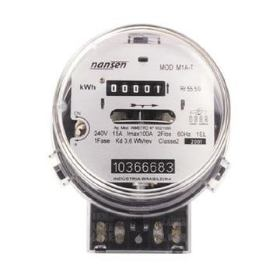

# Classificador de Imagens de Medidores de Energia Elétrica

<p align="center">
  <a target="_blank" rel="noopener noreferrer">
    
  </a>
</p>
</p>
<p align="center">
  <a href="https://opensource.org/licenses/MIT">
    
  </a>
</p>

## 🎲 Dados

Antes de mais nada, para que seja possível o treinamento e a análise dos modelos de machine learning, é necessário uma **base de dados**. Para isso, utilizamos técnicas de [web scrapping](https://en.wikipedia.org/wiki/Web_scraping) para coletar de fotos de medidores de energia elétrica. Chegamos num total de 2373 fotos. Após isso, foi necessario decidir quais imagens eram realmente de um medidor de energia elétrica e estavam com qualidade boa, e quais não estavam ou não era uma imagem de medidor.

Para resolver este problema, utilizamos a técnica de [clustering](https://en.wikipedia.org/wiki/Cluster_analysis), onde foi  encontrado um total de 8 clusters. Ao realizar uma análise mais minunciosa, foi detectado que alguns clusters podiam ser agrupados como imagens boas, imagens ruins e imagens que podiam ser descartadas. Isso resultou num total de 2191 imagens, sendo destas 617 consideradas boas e 1574 consideradas ruins.

O próximo passo foi a extração de features das imagens. Para isso utilizamos a biblioteca [Keras](https://keras.io), ao qual extraiu 32768 features de uma única imagem. Como esse número é relativamente alto e o poder computacional para processar tudo isso é precisa ser levado em consideração, buscamos formas de otimizar as features que tinha uma maior corrrelação. Esse processo gerou um total de 73 features que possuiam a maior correlação.

Como queriamos aumentar a nossa base de dados, e ao tentar aumentar a quantidade de dados coletados mostrou-se ineficaz. Buscamos alternativas e encontramos a estretégia de [data augmentation](https://towardsdatascience.com/data-augmentation-for-deep-learning-4fe21d1a4eb9). Essa abordagem nós possibilitou gerar um total de 10953 imagens sem a necessidade de coletar mais dados.

Como o foco desse repositório é a análise do melhor modelo para identificação de um medidor de energia elétrica, você pode encontrar como foi feita a [extração dos dados](https://github.com/Neoenergia-3/data-mining), a utilização da técnica de [clustering](https://github.com/Neoenergia-3/image-clustering), a estretégia de [data augmentation](https://github.com/Neoenergia-3/image-data-augmentation) e [como geramos um arquivo CSV](https://github.com/Neoenergia-3/image-data-set) em seus respectivos repositórios.

## 👀 Aprendizado Supervisionado

No aprendizado supervisionado, começamos importando um conjunto de dados contendo atributos de treinamento e os atributos de destino(Também conhecidos como ??? Features e labels????). O algoritmo de aprendizado supervisionado aprenderá a relação entre exemplos de treinamento e suas variáveis-alvo(Target) associadas e aplicará esse relacionamento aprendido para classificar entradas totalmente novas.

Para um melhor entendimento de como o aprendizado supervisionado funciona, vamos considerar um exemplo de previsão das notas de um aluno com base no número de horas que ele estudou.

Matematicamente,

Y = f(X) + C

está dividido da seguinte forma:

* f será a relação entre as notas e o número de horas que o aluno preparou para um exame.
* X é a entrada (número de horas que ele preparou).
* Y é a saída (marca a pontuação do aluno no exame).
* C será um erro aleatório.

O objetivo final do algoritmo de aprendizado supervisionado é prever Y com a máxima precisão para uma nova entrada X. Existem várias maneiras de implementar o aprendizado supervisionado e exploraremos algumas das abordagens mais usadas.

Com base nos conjuntos de dados fornecidos, o problema de aprendizado de máquina é categorizado em dois tipos: classificação e regressão. Se os dados fornecidos tiverem valores de entrada (treinamento) e valores de saída (Target), será um problema de classificação. Se o conjunto de dados tiver valores numéricos contínuos de atributos sem nenhum target, será um problema de regressão.

## 📊 Classificação

Considere o exemplo de um pesquisador médico que deseja analisar os dados do câncer de mama para prever um dos três tratamentos específicos que um paciente deve receber. Essa tarefa de análise de dados é chamada de classificação e um modelo ou classificador é construído para prever rótulos de classe, como "tratamento A", "tratamento B" ou "tratamento C."

A classificação é um problema de previsão que prevê os rótulos das classes categóricas, discretas e não ordenadas. É um processo de duas etapas, consistindo em uma etapa de aprendizado e uma etapa de classificação.

Como o problema ao qual nos propomos a resolver, envolve a **classificação** de imagens de medidores de energia elétrica em boas ou ruins, vamos entender agora um pouco sobre os algoritmos que utilizamos.

## 🏘 K-Nearest Neighbors

O algoritmo k-NN(K-Nearest Neighbors) é sem dúvida o mais simples algoritmo de aprendizado de máquina. A construção do modelo consiste apenas em armazenar o conjunto de dados de treinamento. Para fazer uma previsão para um novo ponto de dados, o algoritmo encontra os pontos de dados mais próximos no conjunto de dados de treinamento - seus "Vizinhos mais próximos". Em sua versão mais simples, o algoritmo k-NN considera apenas exatamente um vizinho mais próximo, que é o ponto de dados de treinamento mais próximo do ponto que queremos fazer uma previsão.

## 📈 Regressão Logística

RL aqui

## 🌲 Random Forest

RF aqui

## 🔎 Análise dos Modelos

Qual foi o melhor modelo ?

## 👩🏿‍🍳 Mão na Massa

### Pré-requisitos

- [Docker](https://docs.docker.com/get-docker/)
- [Docker-compose](https://docs.docker.com/compose/install/)

> **nota**: não é necessário a instalação de nenhuma biblioteca adicional.

### Iniciando

Primeiro, tenha certeza que está dentro do diretório do repositório:

```bash
$ cd <path/to/image-classifier>
```

Então, inicie o container:

```bash
$ docker-compose up -d # inicia o container
```

Agora, o Jupyter Notebook vai estar rodando na seguinte URL

```bash
localhost:8888
```

Quando terminar, você pode destruir o conteiner com o seguinte comando:

```zsh
$ docker-compose down # termina o container
```

## 🤝 Contribuição

Se você está interessado em ajudar a contribuir com o projeto, por favor olhe nosso [Guia de Contribuição](https://github.com/Neoenergia-3/image-classifier/CONTRIBUTING.md).

E o nosso muito obrigado a todas as [pessoas que já contribuiram](https://github.com/Neoenergia-3/image-classifier/graphs/contributors) para o projeto!

## 📝 Licença

Copyright © 2020-present, [Contribuidores](https://github.com/Neoenergia-3/image-classifier/graphs/contributors). Esse projeto é [MIT](https://github.com/Neoenergia-3/image-classifier/blob/master/LICENSE) License.
